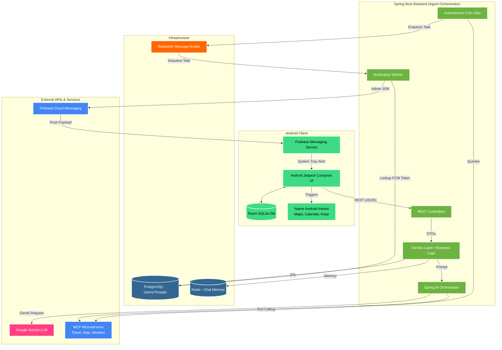

# Cousin In The City - System Architecture & Product Overview

## Product Overview
"Cousin In The City" is an autonomous, AI-driven personal travel assistant. It acts as a proactive "cousin" living in the destination city, helping users plan trips, book accommodations, track flight prices, and navigate the city. Unlike standard chatbots, it bridges the gap between natural language processing and deterministic OS-level execution by securely translating conversational requests into physical Android Intents (Google Calendar, Keep, Maps) and running autonomous background cron jobs to monitor travel data while the app is closed.

### Key Features
1. **Conversational Travel Planning:** Powered by Google Gemini and Spring AI to answer complex, multi-variable travel queries.
2. **Autonomous Tool Calling (MCP):** The AI can dynamically invoke strictly-typed microservices (Travel, Accommodation, Finance, Location) to fetch real-time data like weather or flight prices.
3. **Native OS Automation:** The AI structures its output so the Android client can automatically launch Google Calendar (for itineraries), Google Maps (for navigation), or Google Keep (for saving notes) without user data entry.
4. **Proactive Alerts (FCM):** The backend tracks flight prices asynchronously and wakes up the user's phone with Push Notifications when deals are found, utilizing an enterprise RabbitMQ event queue.
5. **Offline-First Chat UI:** The Android app caches all chat history locally in a Room SQLite database so users can view itineraries without an internet connection.

---

## Architecture Diagram

## Component Explanations

### 1. The Mobile Client (Android Jetpack Compose)
* **User Interface:** A declarative, reactive UI built with Kotlin Jetpack Compose. Follows a strict MVVM (Model-View-ViewModel) architecture.
* **Offline-First Storage:** Uses the Android Room library to cache chat threads and messages locally. The app feels instantaneous because the UI reads exclusively from the local DB while syncing with the backend in the background.
* **Native Intent Handoff:** The App parses strict JSON output (`AgentResponse`) from the backend. If an `intentType` (e.g., `CALENDAR`) is detected, it formats epoch milliseconds and fires an `ACTION_INSERT` Android Intent to natively create Google Calendar events.
* **Firebase Messaging Service:** Intercepts FCM payloads while the app is closed and uses `NotificationManagerCompat` to trigger system tray alerts.

### 2. Agent Orchestrator (Spring Boot)
The central nervous system of the backend, built using Enterprise Clean Architecture (Controller -> Service -> DTO -> Repository).
* **Controllers & Services:** Handles synchronous HTTP requests. Completely decoupled from the database schema via Network DTOs to prevent data leakage.
* **Spring AI Orchestrator:** Manages the conversational memory and function-calling (tools) for the Gemini LLM. It routes the user's plain-text questions to the correct domain experts.
* **Cron Jobs (`PriceTrackerJob`):** Autonomous background tasks scheduled via `@Scheduled` to proactively monitor travel data without user interaction.
* **Notification Listener:** A dedicated worker thread that consumes messages from RabbitMQ and executes external FCM API calls.

### 3. Asynchronous Infrastructure
* **PostgreSQL:** The primary persistent data store for `AppUser` (including FCM tokens) and `ChatThread` metadata.
* **Redis:** High-speed, in-memory datastore used by Spring AI to retrieve and store the conversation history (`ChatMemory`) instantly during LLM generation.
* **RabbitMQ:** An enterprise message broker that decouples heavy tasks (like blasting push notifications) from the main HTTP threads. It includes a Dead Letter Queue (DLQ) to catch and gracefully retry failed tasks.

### 4. External Services
* **Google Gemini:** The core foundational model powering the autonomous decision-making and natural language parsing.
* **Model Context Protocol (MCP) Services:** Isolated domain microservices (`mcp-travel`, `mcp-location`, `mcp-finance`) that expose strict APIs. The LLM acts as an orchestrator, deciding which MCP service has the data needed to answer the user's question.
* **Firebase Cloud Messaging (FCM):** Google's secure push notification gateway. Authenticated via the Firebase Admin SDK Service Account.

